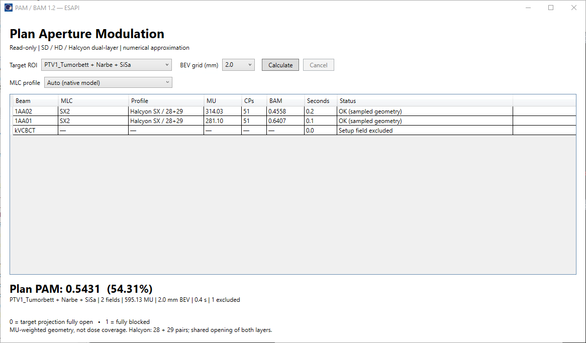

# ESAPI simple GUI 1.2 — SD, HD and Halcyon dual-layer

Download **[PAM_BAM.cs](PAM_BAM.cs)** and run the single-file plug-in from Eclipse
with one external photon plan open. Select the target ROI, MLC profile and press
**Calculate**. Default BEV grid: **2.0 mm**, also selectable at 1.0 and 0.5 mm.
No other repository source, NuGet package or external process is needed.



User-provided screenshot of a successful run: 2.0 mm BEV grid, Auto selecting
Halcyon SX / 28+29, **PAM 0.5431**, **0.4 s** total. One setup field is excluded.
Supplied for publication; timings describe this example only.

The GUI shows beam ID, native MLC model, selected profile, MU, CP count, BAM, elapsed seconds per
field and status, plus the MU-weighted PAM of the complete plan. It provides
progress, cancellation and invalidation when the ROI, grid or MLC selection changes.
Setup fields and zero-MU fields are excluded. A failed treatment field prevents
a partial plan PAM; completed field rows remain visible.

## MLC selection

| Selection | Geometry at isocenter | Required native input |
|---|---|---|
| Auto | Selects a known exact native model alias per beam | Unknown models require explicit selection |
| TrueBeam SD / Millennium 120 | 60 pairs: 10×10 mm, 40×5 mm, 10×10 mm; −200…200 mm | Two banks of 60 pairs and native jaws |
| TrueBeam HD / HD120 | 60 pairs: 14×5 mm, 32×2.5 mm, 14×5 mm; −110…110 mm | Two banks of 60 pairs and native jaws |
| Dual-layer / Halcyon SX | 28 then 29 pairs, 10 mm wide, staggered 5 mm; fixed 280×280 mm field | Two banks of 57 pairs in fixed 28+29 blocks |

Auto recognizes HD120/High Definition 120, Millennium/Millenium 120 and
Halcyon/SX1/SX2 aliases, with optional listed Varian prefixes (see `ModelKind`).
A known native model conflicting with the selected profile is rejected. An
unknown local model name can be used only through explicit profile selection;
this is a user assertion about the commissioned machine, not automatic detection.
Both SD and HD have 60 pairs, so their geometry cannot be inferred from count.
The script never changes the TPS machine or leaf positions.

### Halcyon native order

Select **Dual-layer / Halcyon SX**, or Auto with a recognized SX model.
The native order is fixed: **28 pairs first (indices 0…27), then 29 pairs
(indices 28…56)**. Within each layer, indices run toward increasing BLD Y.
The 28-pair strip boundaries are −140…140 mm in 10 mm steps; the 29-pair
boundaries are −145…145 mm.

Local user testing confirmed 28+29 and rejected the other choices offered in
version 1.1. Those choices were unverified assumptions and have been removed.
The synthetic tests in 1.1 verified arithmetic under each assumed mapping;
they did not establish the native ordering. The regression tests now construct
asymmetric inputs using fixed native indices independently of the profile.

The calculation uses the **intersection** of both real 10 mm strip openings,
including their 5 mm stagger. It does not substitute 57 narrow single-layer
leaves. Fixed limits of ±140 mm in X/Y replace physical jaw clipping on Halcyon;
placeholder native jaws are not read. SX1 and SX2 are supported only when the
API supplies both complete layers. Other arrays, reversed indexing or another
manufacturer's dual-layer MLC require a separately verified profile.

## Geometry and scope

- **HFS**, static couch yaw, conventional IEC frame. The script checks native
  source positions against that frame, including two independent gantry
  directions. Unknown source geometry is rejected.
- All supplied profiles use X-travelling leaves; all native positions and
  mesh coordinates are in millimetres. Layer widths are explicit because the
  public ESAPI MLC object does not expose them.
- Applicators, custom blocks, wedges, compensators, motion compensation,
  changing table positions and unsupported orientation/geometry are rejected.
- The native ROI surface mesh is copied in memory and projected with beam
  divergence **at every CP**. Projected triangles form a union on the BEV grid;
  holes and disconnected components are retained. No convex hull, bounding-box
  target substitute, start-angle outline reuse, temporary ROI or DICOM export.
- Grid spacing affects BEV sampling only; the native mesh is not revoxelized.
  RayStation GUI 1.1 also projects surfaces, using a native mesh when exposed
  and a voxel surface otherwise. Different native meshes or the voxel fallback
  do not imply bit-identical cross-TPS results. Compare resolutions locally.

## MU weighting

ESAPI `ControlPoint.MetersetWeight` is **cumulative**, unlike the native segment
weights used in the RayStation GUI. Each interval's incremental MU contributes
half to either endpoint. We normalize by the final cumulative weight; repeated
weights add no MU. This is the repository's trapezoidal CP approximation,
not continuous integration of moving leaves. Plan PAM uses native beam MU;
`Beam.WeightFactor` is not multiplied in.

AM/BAM/PAM describe geometry, not dose coverage or clinical pass/fail. The
plug-in is read-only: no writeable attribute, BeginModifications, patient save,
contour changes, dose calculation, network traffic, patient logging or exports.
All ESAPI reads remain on the owning STA thread; UI event pumping does not
transfer API objects to workers.

## Verification

- Compiled as an x64 library using C# 5 syntax and .NET Framework 4.8 references
  against locally available **ESAPI API/Types, API file version 18.0.1.261**.
  This compile check includes the actual ESAPI adapter and WPF GUI.
- **65 vendor-free synthetic assertions passed**: perspective mesh projections
  vs independent ray/box intersections, disconnected targets and a through-hole,
  source-plane rejection, cancellation, IEC cardinal/couch/collimator frames,
  actual SD/HD inner/outer widths, jaw clipping, closed/half-open apertures,
  fixed 28+29 native blocks, asymmetric index regression, disjoint layer openings, 5 mm stagger,
  fixed Halcyon limits, model/mapping/bank guards, zero/decreasing cumulative
  MU and plan aggregation.
- The user confirms successful **version 1.2** execution in Eclipse with the
  **28+29** Halcyon profile and supplied the screenshot above for publication.
  The displayed run used a 2.0 mm grid and reported PAM 0.5431 in 0.4 s.
  Compilation, numerical tests and this runtime feedback do not validate every machine configuration or clinical
  accuracy. Test an asymmetric ROI/field at several gantry, collimator and couch
  angles, check MU and native MLC identity/index ordering, and compare 2/1/0.5 mm
  results before relying on the reported numbers.

Run the numerical tests without vendor assemblies:

```text
dotnet run --project scripts/esapi/tests/CoreTests.csproj
```

The test project uses .NET 10; this is **not** the Eclipse runtime requirement.
Alternatively, a .NET Framework C# compiler can build the same tests:

```text
csc /target:exe /platform:x64 /langversion:5 /define:PAMBAM_CORE_TEST /out:CoreTests.exe scripts/esapi/PAM_BAM.cs scripts/esapi/tests/CoreTests.cs
CoreTests.exe
```

For a local native compile check, build `PAM_BAM.cs` as an x64 class library with
the installed `VMS.TPS.Common.Model.API.dll` and `VMS.TPS.Common.Model.Types.dll`,
plus .NET Framework 4.8 System, System.Core, System.Xml, System.Xaml, WindowsBase,
PresentationCore and PresentationFramework references. Vendor DLLs and compiled
binaries are not published here. A binary plug-in, if built locally, must have
the `.esapi.dll` extension; the `.cs` file can be run directly from Eclipse.

## API references

- [Varian: data-model access to Halcyon dual-layer MLC introduced in ESAPI 16](https://docs.developer.varian.com/articles/16.0/04_About_the_Eclipse_Scripting_API.html)
- [Halcyon stacked/staggered MLC and SX1/SX2: Frontiers in Oncology 2019](https://www.frontiersin.org/journals/oncology/articles/10.3389/fonc.2019.00319/full)

- [SD and HD120 leaf geometry: Boudet et al., JACMP 2022, Section 2.1](https://pmc.ncbi.nlm.nih.gov/articles/PMC9278673/)
- [ControlPoint: coordinates, leaf banks, cumulative meterset](https://docs.developer.varian.com/api/16.1/VMS.TPS.Common.Model.API.ControlPoint.html)
- [MLC: model identity](https://docs.developer.varian.com/api/16.1/VMS.TPS.Common.Model.API.MLC.html)
- [Structure: native MeshGeometry](https://docs.developer.varian.com/api/16.1/VMS.TPS.Common.Model.API.Structure.html)
- [Beam: GetSourceLocation and GetStructureOutlines](https://docs.developer.varian.com/api/16.1/VMS.TPS.Common.Model.API.Beam.html)
- Metric: Hernandez et al., *Medical Physics* 2025;52(12):e70144,
  [doi:10.1002/mp.70144](https://doi.org/10.1002/mp.70144).
