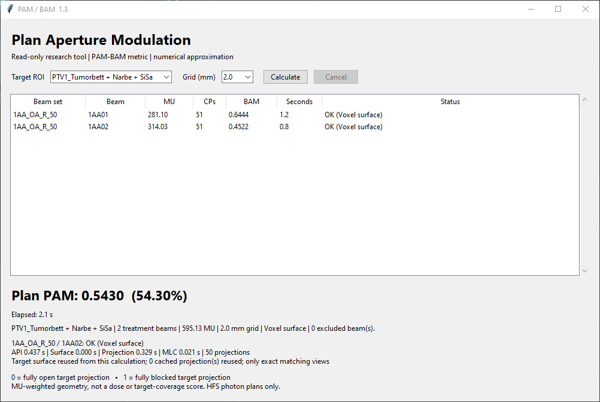

# RayStation simple GUI 1.3

Download **[PAM_BAM.py](PAM_BAM.py)** and run it as a file script in RayStation
CPython with a plan open. Select the target ROI, select 2.0 / 1.0 / 0.5 mm and
press **Calculate**. No package installation or sibling files are needed if
NumPy and Tkinter are present in the RayStation Python environment.



User-provided screenshot of a successful 2024 run: 2.0 mm grid, two treatment
beams, **PAM 0.5430**, **2.1 s** total. Supplied for publication; timings describe
this example only.

- BAM for each treatment beam, PAM for the entire open plan using beam MU.
- Live total/beam timer and a **Seconds** column; the final times remain visible.
- Select a beam row for separate **API / Surface / Projection / MLC** times,
  projection/reuse counts, ROI grid dimensions, block count and surface-face count.
- Surface projection with a **2.0 mm default** grid, also selectable at 1.0/0.5 mm.
- Read-only: no patient save, contour change, dose calculation or export.
- Divergent target projection at every CP; actual MLC strip widths and centres;
  effective opening is the intersection of the layers and native jaw limits.
- HFS photon SMLC, DMLC, DynamicArc and StaticArc with supported IEC geometry.
- Static couch yaw; pitch/roll/gimbal, virtual CPs and unsupported accessories
  produce an explanation. Unknown geometry never becomes a valid zero result.
- Zero-MU and setup beams are excluded. A failed treatment beam or different
  planning examinations prevents calculation of a partial plan PAM.

## Numerical method

Native `RelativeWeight` is used as a segment share of total beam MU, as
documented in the RayStation v2025 SP2 API. It is not interpreted as cumulative
meterset. Like the ESAPI viewer, version 1.1 projects a surface instead of
tracing each BEV ray through the volume. The source is shown in each beam row:

- **Native mesh**: read `PrimaryShape.Vertices`, `Indices` and `IsClosed` when
  available. No resampling; the selected grid affects only the BEV plane.
- **Voxel surface**: when no native mesh is exposed, read the entire ROI at the
  selected spacing, threshold at >=128/255, and extract its exact exposed block
  faces in memory. Only coplanar rectangles are merged. Both voxel and BEV grids
  still use the selected spacing, as in 1.0. There is no smoothing or convex hull.

Version 1.2 reads large voxel grids in bounded Z slabs. The former 16-million
voxel limit applies to each API request, not to the whole ROI. One neighbour
slice at either end establishes the actual surface at slab interfaces; halo
faces are excluded. The selected spacing is unchanged. This fixes the script's
`ROI grid too large` failure at 0.5 mm for volumes exceeding the former total
limit. Separate limits still apply to the XY cross-section, surface-face count
and BEV pixel count; they report their own specific errors.

Both paths include beam divergence and retain holes/disconnected targets.
Pixel centres exactly on silhouette edges are included; such boundary samples
can differ from the old ray routine's strict entry/exit convention.
No `SetRepresentation`, temporary ROI or TPS model modification is used. Native
meshes and thresholded voxel surfaces can give different sampled results;
cross-TPS agreement is not implied by matching grid numbers. This also differs
from the library's exact area calculation for supplied rectangle unions.
Compare 1.0 and 0.5 mm results to assess convergence for a particular geometry.

Surface preparation is cached across beams on the same examination; consecutive
identical CP frames reuse the projection. Changing frames get a new projection.
Version 1.2 also caches each projection's sample-to-leaf mapping. Each CP then
compares samples with their associated leaf tips, instead of testing every
sample against every leaf. Gaps, stagger, native ordering and layer-intersection
semantics are preserved.

Version 1.3 keeps the existing Python/NumPy/Tkinter deployment for RayStation
2024. It adds no DLL, package installation, local-folder requirement or
v2025-only native BAM API. The projector performs one large matrix multiply,
uses contiguous coordinate arrays and processes polygon edges in bounded
scanline batches. The raster, divergent geometry, edge tolerances, MLC/jaw
rules and MU weights are retained.

Identical target projections can also be reused across beams. The cache key
includes the exact isocenter, SAD, full beam frame and grid spacing; each target
surface owns its cache. It holds at most 64 MiB / 128 views per surface and is
discarded after Calculate. Different views are recalculated without angle
rounding; changed CP leaves/jaws always receive a fresh aperture evaluation.
The detail panel reports actual projection calls and cache hits separately.

All API access remains on the script thread. The timer updates during the
calculation through Tk event processing (about every 100 ms). A synchronous
native API read can temporarily block repainting; elapsed time includes that
interval and catches up afterward. The first beam's time includes surface setup.
The phase detail includes native reads and their data conversion under **API**,
mesh/block-face construction under **Surface**, target projection under
**Projection**, and strip mapping/aperture evaluation under **MLC**. Phase times
are diagnostic; their sum excludes some GUI, validation and orchestration time.
They are kept in memory and displayed only, with no patient-data export/logging.

Jawless machines need absent `JawPhysics` or valid native fixed field limits.
Zero placeholder limits are rejected and require local geometry verification.
The script contains the full scope and coordinate assumptions in its header.

## Test status

The user reports a successful RayStation run of **version 1.0**, with about
**4 seconds per field at a 2 mm grid**. That original source is preserved in
[commit dac51a6](https://github.com/Kiragroh/PAM-BAM/blob/dac51a6/scripts/raystation/PAM_BAM.py)
(SHA-256
`D8060D8E376046431D0328DB31258C9C1291FB05846D9C5C4ECAAEBE0C13B0A9`).
The user also ran **1.1** with the voxel-surface path and reported that it
remained substantially slower than Eclipse; its 0.5 mm run hit the script's
16M total-voxel guard. The subsequent **1.2** run on the user's 2024 system
identified the projection phase as the main remaining cost. The user then
confirmed a successful **1.3** run in RayStation 2024 and supplied the screenshot
above: 2.0 mm, 1.2 / 0.8 s per beam and 2.1 s total, with PAM 0.5430.
Neither runtime feedback nor synthetic tests establish dosimetric
accuracy, all-machine compatibility or clinical commissioning.

The **38 synthetic tests** cover independent ray/box intersections, analytical
perspective projection, holes/disconnected targets, MLC/jaw intersections,
MU weights, changing CP angles, API guards and Tk GUI calculation/cancellation,
native mesh reading, surface-vs-ray comparison at oblique angles, and the timer.
New regressions cover a 0.5 mm grid above 16M voxels, bounded native requests at
unchanged spacing, holes across slab boundaries, cached strip lookup against an
independent union calculation, and phase timing with simulated API delay.
Version 1.3 adds 720 exact-mask comparisons against the frozen 1.2 projector:
triangles/quads, holes/disconnected components, 2/1/0.5 mm grids, oblique and
cardinal views, translated targets, X/Y leaf travel, 28+29 dual layers, jaws and
changing MU weights. All compared BAM/PAM values are identical. Additional
tests cover silhouette boundaries, nearly horizontal edges, scanline batching,
cache invalidation/eviction and changed leaves despite a reused target.
They contain only synthetic geometry and names:

```text
python -B -m unittest discover -s scripts/raystation/tests -p "test_*.py" -v
```

## NumPy speed comparison (1.3 versus 1.2)

Synthetic sphere with a through-hole, 8 cm box, 50 gantry views, 27-degree
collimator. Python 3.13.13, NumPy 2.4.4, Windows x64. Median of three timed
repetitions after warm-up; old/new order alternates. Every occupied sample
matched exactly. No cache hits were used in this benchmark.

| Grid | Faces | 1.2 projection | 1.3 projection | Speedup |
|---|---:|---:|---:|---:|
| 2.0 mm | 2,536 | 0.111 s | 0.039 s | 2.85x |
| 1.0 mm | 10,248 | 0.511 s | 0.287 s | 1.78x |
| 0.5 mm | 40,856 | 1.873 s | 0.961 s | 1.95x |

These are projection-only CPU times, excluding surface preparation, API,
MLC and GUI costs. They do not predict the complete RayStation 2024 runtime.
Use the unchanged total/beam timer and phase details for that comparison.

```text
python -B scripts/raystation/tests/benchmark_numpy.py
```

## Earlier projection-only speed comparison (1.1)

One local CPU run of [benchmark_projection.py](tests/benchmark_projection.py),
five views of a sphere with a through-hole in an 8 cm box. Every occupied BEV
sample matched the old ray algorithm. These are numerical-kernel timings;
RayStation API calls, MLC evaluation and GUI overhead are excluded.

| Grid | Surface setup, once | Old rays, 5 views | New surface, 5 views | Projection speedup |
|---|---:|---:|---:|---:|
| 2.0 mm | 0.024 s | 0.027 s | 0.012 s | 2.3× |
| 1.0 mm | 0.096 s | 0.177 s | 0.049 s | 3.6× |
| 0.5 mm | 0.400 s | 1.802 s | 0.182 s | 9.9× |

Including setup, this five-view example is 0.8×/1.2×/3.1× as fast at 2/1/0.5 mm.
Setup can outweigh the gain for a small number of views. Use the new live timer
to measure the complete calculation in RayStation; these timings do not promise
equal wall-clock performance to Eclipse.
The later native feedback is the reason 1.2 adds phase timings: a fast isolated
projection benchmark does not identify the dominant cost inside RayStation.

```text
python scripts/raystation/tests/benchmark_projection.py
```

Tk tests require a desktop session. API documentation basis: v2025 SP2 / 17.2.0;
the user-confirmed run above used RayStation 2024. Test fixtures contain only
synthetic geometry and names; the GUI screenshot was supplied by the user for publication.
